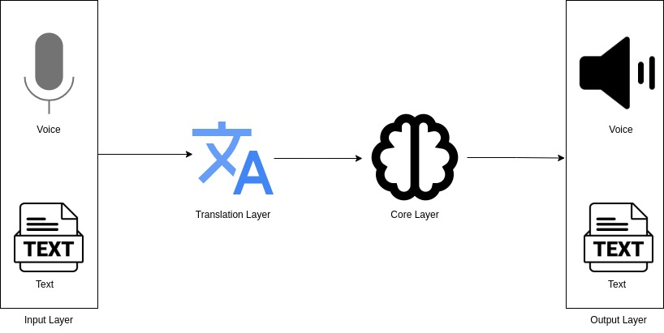
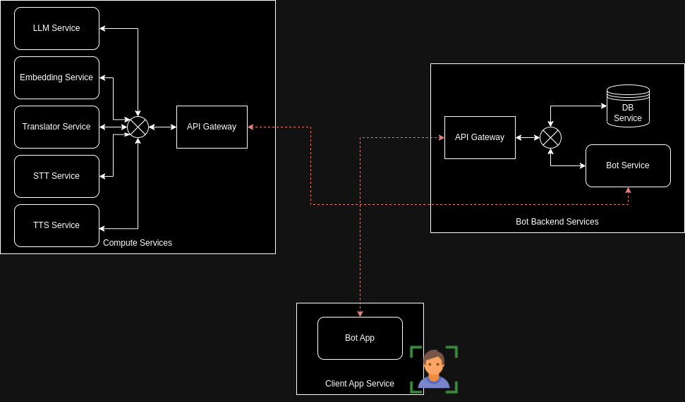

# NodeJs Rag Services
This is a complete end-to-end RAG solution using NodeJs.

## System Overview


## System Architecture


## Components

We have divided the system into 3 main components.

### Compute Service:

This is the heavy computation services of the system.

- **LLM Service** - LLM is up and running here
- **Embedding Service** - Sentence/Document embedding service is running here
- **Translator Service** - All direction translation service is running here
- **STT Service** - Speech-To-Text service is running here
- **TTS Service** - Text-To-Speech service is running here

### Bot Backend:

This is the full RAG pipeline which answers a user query using the available knowledge bases fed to the system.

- **Bot Service** - The RAG pipeline
- **DB Service** - The RAG knowledge base store

### Client App:

Client frontend App that the user interacts with the bot/system.

## Setup

The 3 services should be run as 3 separate services.
- Compute Service is independent from others
- Bot Backend is depend upon the Computre Service
- Bot Frontend is depend upon the Bot Backend

You can access the services as follws

### Steps to Start

1. Start the compute service
```
cd compute_service
npm i
npm start
```

2. Start the bot backend
```
cd bot_backend
npm i
npm start
```

3. Start the frontend app
```
cd bot_frontend
npm i
npm start
```

## Dockerization

This option will be availble in the future

<!-- ROADMAP -->
## Roadmap

- [ ] Complete Bot Backend
    - [x] Basic RAG Flow
    - [ ] Add knowledge to vector db throug API
- [ ] Complete Compute Service
    - [ ] LLM Service
    - [ ] Embedding Service
    - [ ] Translation Service
    - [ ] ASR Service
    - [ ] TTS Service
- [ ] Complete Frontend APP